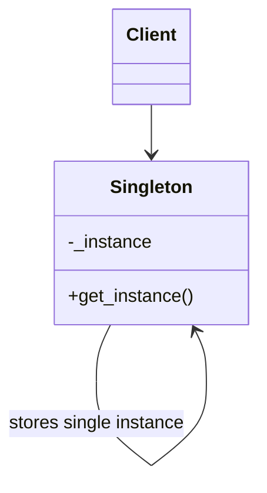

# Singleton Pattern

## Target Pattern

**Pattern Name:** Singleton

**Programming Language:** Python

**Learning Goal:** Học để hiểu "ngôn ngữ chung" giữa lập trình viên, phỏng vấn, và nhận biết khi nào nên tránh global state.

---

## 1. Foundations

### 1.1 Problem Statement

Trong một số tình huống, hệ thống chỉ nên có đúng một instance của một class: cấu hình ứng dụng, registry, connection manager, logger, hoặc object quản lý tài nguyên dùng chung.

Pain point trước khi dùng Singleton:

- Nhiều nơi trong code tự tạo instance riêng, dẫn đến state không nhất quán.
- Tài nguyên đắt đỏ bị khởi tạo nhiều lần.
- Không có điểm truy cập thống nhất cho object dùng chung.

Dấu hiệu thường gặp:

- Nhiều object cấu hình khác nhau tồn tại cùng lúc.
- Code truyền cùng một dependency qua quá nhiều lớp chỉ để dùng chung.
- Có logic kiểm tra "đã khởi tạo chưa" lặp lại ở nhiều nơi.

### 1.2 Intent & Definition

Singleton đảm bảo một class chỉ có một instance duy nhất và cung cấp một điểm truy cập toàn cục đến instance đó.

Singleton thuộc nhóm **Creational Pattern** vì nó kiểm soát quá trình tạo object.

Ý tưởng cốt lõi: thay vì để client tự do gọi constructor, class tự quản lý instance duy nhất của nó.

### 1.3 UML Structure



Thành phần chính:

- `Singleton`: class quản lý instance duy nhất.
- `_instance`: biến class lưu instance.
- `get_instance()`: điểm truy cập dùng chung.
- `Client`: code sử dụng Singleton thay vì tự tạo nhiều instance.

---

## 2. Implementation Styles

### 2.1 Standard Implementation

```python
class AppConfig:
    _instance = None

    def __new__(cls):
        if cls._instance is None:
            cls._instance = super().__new__(cls)
            cls._instance.settings = {}
        return cls._instance

    def set(self, key: str, value: str) -> None:
        self.settings[key] = value

    def get(self, key: str) -> str | None:
        return self.settings.get(key)


config_a = AppConfig()
config_b = AppConfig()

config_a.set("env", "production")

print(config_b.get("env"))      # production
print(config_a is config_b)     # True
```

Điểm quan trọng:

- `__new__` kiểm soát việc tạo object trước `__init__`.
- `_instance` nằm ở cấp class nên được chia sẻ.
- Mọi lần gọi `AppConfig()` đều trả về cùng một object.

### 2.2 Common Variations

- **Eager Singleton:** tạo instance ngay khi module/class được load.
- **Lazy Singleton:** chỉ tạo instance khi lần đầu được dùng.
- **Thread-safe Singleton:** dùng lock để tránh race condition trong môi trường đa luồng.
- **Module-level Singleton:** trong Python, một module tự nhiên đã hoạt động gần giống Singleton vì module chỉ được import một lần.
- **Dependency Injection alternative:** thay vì Singleton thật, tạo object một lần ở composition root rồi inject vào nơi cần dùng.

### 2.3 Key Mechanisms

- Object lifecycle control
- Class-level state
- Lazy initialization
- Controlled access
- Global access point

---

## 3. Challenges & Pitfalls

### 3.1 Complexity Trade-offs

Singleton có vẻ đơn giản nhưng dễ làm code phụ thuộc vào global state. Khi nhiều nơi gọi trực tiếp `AppConfig()`, dependency thật sự bị ẩn đi, khiến code khó đọc và khó kiểm thử.

### 3.2 Common Mistakes

- Dùng Singleton cho mọi service chỉ vì muốn "truy cập tiện".
- Lưu mutable state phức tạp trong Singleton.
- Không xử lý thread-safety khi chạy trong môi trường concurrent.
- Làm unit test phụ thuộc lẫn nhau vì Singleton giữ state giữa các test.
- Nhầm Singleton với object được tạo một lần bởi dependency injection container.

### 3.3 Constraints

- Khó mock nếu code gọi Singleton trực tiếp.
- Có thể vi phạm Single Responsibility Principle nếu Singleton vừa quản lý lifecycle vừa chứa logic nghiệp vụ.
- Có thể gây coupling cao vì client biết class cụ thể.
- Trong multiprocessing, mỗi process vẫn có Singleton riêng.

---

## 4. Best Practices & Applications

### 4.1 Real-world Use Cases

- Configuration object trong ứng dụng nhỏ.
- Logger dùng chung.
- Registry quản lý plugin.
- Cache in-memory đơn giản.
- Database connection pool manager, nhưng không nên biến chính connection thành Singleton thô.

Trong Python, module-level object thường là lựa chọn tự nhiên hơn:

```python
# settings.py
CONFIG = {"env": "production"}
```

### 4.2 Comparison With Similar Patterns

| Pattern | Điểm giống | Điểm khác | Khi nào dùng |
|---|---|---|---|
| Singleton | Kiểm soát việc tạo object | Chỉ cho phép một instance | Cần một instance dùng chung |
| Factory Method | Cũng liên quan đến tạo object | Không giới hạn số instance | Cần linh hoạt chọn class cụ thể |
| Dependency Injection | Có thể tạo một instance dùng chung | Dependency được truyền rõ ràng | Muốn test tốt và coupling thấp |

### 4.3 When To Avoid

Không nên dùng Singleton khi:

- Object có state thay đổi nhiều.
- Cần unit test độc lập.
- Cần nhiều cấu hình khác nhau trong cùng runtime.
- Dependency nên được thể hiện rõ qua constructor.
- Chỉ dùng vì muốn tránh truyền tham số.

---

## 5. Interview & Deep Thinking

### 5.1 Interview Questions

- Singleton giải quyết vấn đề gì?
- Singleton có phải lúc nào cũng là anti-pattern không?
- Vì sao Singleton làm unit test khó hơn?
- Singleton trong Python khác Java/C# như thế nào?
- Làm sao triển khai Singleton thread-safe?
- Module trong Python có thể thay thế Singleton không?

### 5.2 Design Discussion

Singleton hữu ích khi cần một điểm truy cập nhất quán, nhưng trong hệ thống lớn nên cân nhắc dependency injection. Nếu requirement thay đổi từ "một instance duy nhất" sang "một instance theo tenant/user/request", Singleton sẽ trở thành rào cản kiến trúc.

---

## 6. Summary

### One-line Definition

Singleton đảm bảo một class chỉ có một instance duy nhất và cung cấp điểm truy cập toàn cục đến instance đó.

### Mental Model

Một "trạm trung tâm" dùng chung cho toàn bộ ứng dụng.

### Use When

- Cần đúng một object quản lý tài nguyên dùng chung.
- Việc tạo object tốn kém và phải được kiểm soát.
- State dùng chung thực sự là một phần của kiến trúc.

### Avoid When

- Chỉ muốn truy cập tiện hơn.
- Object có state mutable phức tạp.
- Code cần test/mocking nhiều.

### Key Takeaway

Singleton là pattern dễ nhận biết nhất, nhưng cũng dễ bị lạm dụng nhất; hãy ưu tiên dependency rõ ràng khi hệ thống lớn lên.
