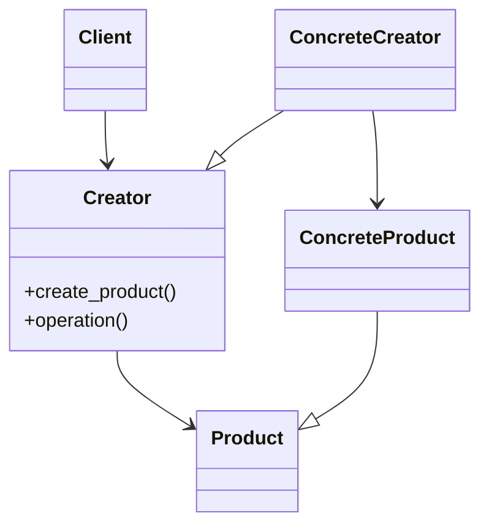
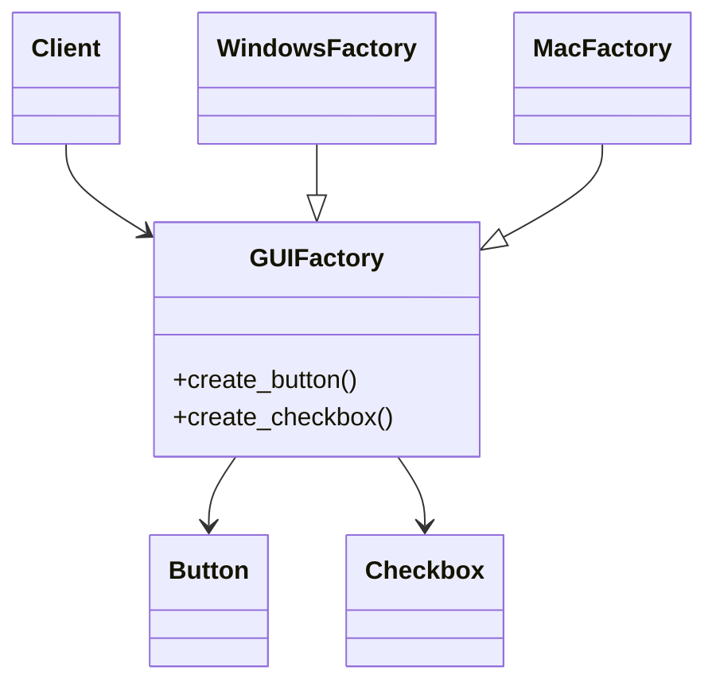

# Factory Method & Abstract Factory Patterns

## Target Pattern

**Pattern Name:** Factory Method / Abstract Factory

**Programming Language:** Python

**Learning Goal:** Hiểu cách tạo object linh hoạt mà client không phụ thuộc trực tiếp vào class cụ thể.

---

## 1. Foundations

### 1.1 Problem Statement

Khi client code gọi trực tiếp constructor của class cụ thể, code bị coupling với implementation. Nếu cần thay đổi loại object được tạo theo cấu hình, môi trường, plugin, hoặc platform, client sẽ phải chứa nhiều `if/elif` và biết quá nhiều chi tiết.

Pain point:

- Client phụ thuộc vào concrete class.
- Logic tạo object nằm rải rác.
- Thêm loại object mới phải sửa nhiều nơi.
- Khó test vì không dễ thay thế implementation.

### 1.2 Intent & Definition

**Factory Method** định nghĩa một phương thức tạo object, cho phép subclass hoặc creator quyết định concrete product nào được tạo.

**Abstract Factory** cung cấp interface để tạo một họ object liên quan mà không chỉ định class cụ thể của chúng.

Cả hai thuộc nhóm **Creational Pattern**.

### 1.3 UML Structure

Factory Method:



Abstract Factory:



---

## 2. Implementation Styles

### 2.1 Standard Implementation

Factory Method:

```python
from abc import ABC, abstractmethod


class Notification(ABC):
    @abstractmethod
    def send(self, message: str) -> None:
        pass


class EmailNotification(Notification):
    def send(self, message: str) -> None:
        print(f"Email: {message}")


class SmsNotification(Notification):
    def send(self, message: str) -> None:
        print(f"SMS: {message}")


class NotificationFactory:
    @staticmethod
    def create(channel: str) -> Notification:
        if channel == "email":
            return EmailNotification()
        if channel == "sms":
            return SmsNotification()
        raise ValueError(f"Unsupported channel: {channel}")


notification = NotificationFactory.create("email")
notification.send("Your order has shipped")
```

Abstract Factory:

```python
from abc import ABC, abstractmethod


class Button(ABC):
    @abstractmethod
    def render(self) -> None:
        pass


class Checkbox(ABC):
    @abstractmethod
    def render(self) -> None:
        pass


class LightButton(Button):
    def render(self) -> None:
        print("Render light button")


class LightCheckbox(Checkbox):
    def render(self) -> None:
        print("Render light checkbox")


class DarkButton(Button):
    def render(self) -> None:
        print("Render dark button")


class DarkCheckbox(Checkbox):
    def render(self) -> None:
        print("Render dark checkbox")


class ThemeFactory(ABC):
    @abstractmethod
    def create_button(self) -> Button:
        pass

    @abstractmethod
    def create_checkbox(self) -> Checkbox:
        pass


class LightThemeFactory(ThemeFactory):
    def create_button(self) -> Button:
        return LightButton()

    def create_checkbox(self) -> Checkbox:
        return LightCheckbox()


class DarkThemeFactory(ThemeFactory):
    def create_button(self) -> Button:
        return DarkButton()

    def create_checkbox(self) -> Checkbox:
        return DarkCheckbox()


def render_form(factory: ThemeFactory) -> None:
    button = factory.create_button()
    checkbox = factory.create_checkbox()
    button.render()
    checkbox.render()


render_form(DarkThemeFactory())
```

### 2.2 Common Variations

- Simple Factory: một hàm/class tạo object dựa trên tham số.
- Factory Method bằng subclass: mỗi subclass override phương thức tạo object.
- Registry-based Factory: mapping key sang class/function để tránh `if/elif`.
- Abstract Factory cho product family: tạo nhiều object liên quan cùng theme/platform.

### 2.3 Key Mechanisms

- Encapsulation of object creation
- Polymorphism
- Dependency inversion
- Interface-based programming
- Runtime selection

---

## 3. Challenges & Pitfalls

### 3.1 Complexity Trade-offs

Factory thêm abstraction quanh việc tạo object. Nếu hệ thống chỉ có một hoặc hai class và không có nhu cầu thay đổi, factory có thể khiến code dài hơn mà không có lợi ích rõ.

### 3.2 Common Mistakes

- Tạo factory chỉ để gọi constructor một cách máy móc.
- Đưa quá nhiều business logic vào factory.
- Dùng Abstract Factory khi chỉ cần Simple Factory.
- Factory trả về concrete type thay vì interface/abstract type.
- Dùng chuỗi magic string rải rác để chọn loại object.

### 3.3 Constraints

- Có thể làm flow tạo object khó lần theo.
- Abstract Factory tăng số lượng class nhanh khi có nhiều product family.
- Nếu interface product thiết kế kém, factory không giải quyết được coupling thật sự.

---

## 4. Best Practices & Applications

### 4.1 Real-world Use Cases

- Framework web tạo request handler/controller.
- ORM tạo database connection theo driver.
- UI toolkit tạo component theo platform/theme.
- Plugin system tạo plugin theo config.
- Serializer/deserializer chọn JSON, XML, YAML theo content type.

### 4.2 Comparison With Similar Patterns

| Pattern | Điểm giống | Điểm khác | Khi nào dùng |
|---|---|---|---|
| Factory Method | Tạo object qua abstraction | Thường tạo một loại product | Khi subclass/config quyết định product |
| Abstract Factory | Tạo object qua abstraction | Tạo cả họ product liên quan | Khi cần đảm bảo các object tương thích với nhau |
| Builder | Cũng tạo object | Tập trung vào object phức tạp nhiều bước | Khi construction có nhiều bước/option |
| Prototype | Cũng tạo object | Clone object mẫu | Khi copy object rẻ hơn tạo mới |

### 4.3 When To Avoid

- Object rất đơn giản và ít thay đổi.
- Không có nhiều concrete implementation.
- Constructor đã đủ rõ ràng.
- Factory chỉ bọc constructor mà không giảm coupling.

---

## 5. Interview & Deep Thinking

### 5.1 Interview Questions

- Factory Method khác Abstract Factory thế nào?
- Khi nào dùng Simple Factory là đủ?
- Factory giúp tuân thủ Open/Closed Principle ra sao?
- Factory có thể vi phạm Single Responsibility Principle không?
- Làm sao tránh `if/elif` dài trong factory?

### 5.2 Design Discussion

Factory hữu ích nhất khi việc tạo object là một quyết định kiến trúc, không chỉ là cú pháp. Nếu requirement thêm loại notification mới, client không nên phải đổi. Nếu thêm cả một họ UI component theo theme, Abstract Factory giúp giữ các component cùng family.

---

## 6. Summary

### One-line Definition

Factory tách logic tạo object khỏi client, giúp client phụ thuộc vào abstraction thay vì concrete class.

### Mental Model

Một "xưởng sản xuất" object: client yêu cầu loại cần dùng, factory quyết định tạo class cụ thể.

### Use When

- Cần chọn implementation tại runtime.
- Muốn gom logic tạo object về một nơi.
- Có nhiều concrete class cùng interface.

### Avoid When

- Chỉ có một concrete class.
- Constructor đơn giản và ổn định.
- Factory không giúp giảm coupling.

### Key Takeaway

Factory không chỉ làm code "đẹp hơn"; giá trị thật của nó là kiểm soát dependency vào concrete class.
