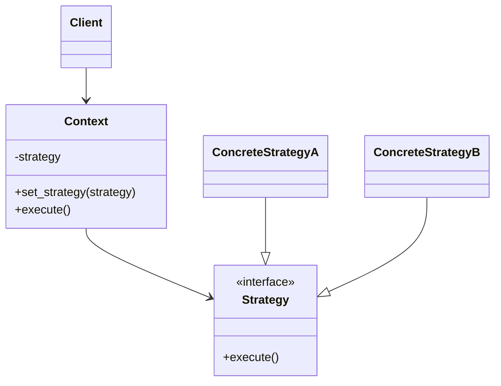

# Strategy Pattern

## Target Pattern

**Pattern Name:** Strategy

**Programming Language:** Python

**Learning Goal:** Hiểu cách thay đổi thuật toán linh hoạt tại runtime, đặc biệt trong Python.

---

## 1. Foundations

### 1.1 Problem Statement

Khi một class có nhiều biến thể thuật toán, code thường phình ra thành nhiều nhánh `if/elif`. Mỗi lần thêm thuật toán mới, class chính phải sửa, test lại, và dễ vi phạm Open/Closed Principle.

Pain point:

- Một class chứa quá nhiều logic lựa chọn thuật toán.
- Thêm hành vi mới phải sửa code cũ.
- Code khó test từng thuật toán riêng biệt.
- Runtime cần đổi hành vi nhưng class bị hard-code.

### 1.2 Intent & Definition

Strategy định nghĩa một họ thuật toán, đóng gói từng thuật toán thành object/function riêng, và cho phép thay thế chúng linh hoạt.

Strategy thuộc nhóm **Behavioral Pattern**.

### 1.3 UML Structure



---

## 2. Implementation Styles

### 2.1 Standard Implementation

```python
from abc import ABC, abstractmethod


class PricingStrategy(ABC):
    @abstractmethod
    def calculate(self, amount: float) -> float:
        pass


class RegularPricing(PricingStrategy):
    def calculate(self, amount: float) -> float:
        return amount


class VipPricing(PricingStrategy):
    def calculate(self, amount: float) -> float:
        return amount * 0.9


class BlackFridayPricing(PricingStrategy):
    def calculate(self, amount: float) -> float:
        return amount * 0.7


class Checkout:
    def __init__(self, strategy: PricingStrategy) -> None:
        self.strategy = strategy

    def set_strategy(self, strategy: PricingStrategy) -> None:
        self.strategy = strategy

    def total(self, amount: float) -> float:
        return self.strategy.calculate(amount)


checkout = Checkout(RegularPricing())
print(checkout.total(100))

checkout.set_strategy(BlackFridayPricing())
print(checkout.total(100))
```

Pythonic variation với function:

```python
from collections.abc import Callable


DiscountStrategy = Callable[[float], float]


def regular(amount: float) -> float:
    return amount


def vip(amount: float) -> float:
    return amount * 0.9


class Checkout:
    def __init__(self, discount: DiscountStrategy) -> None:
        self.discount = discount

    def total(self, amount: float) -> float:
        return self.discount(amount)


checkout = Checkout(vip)
print(checkout.total(100))
```

### 2.2 Common Variations

- Class-based Strategy: phù hợp khi thuật toán có state hoặc nhiều method.
- Function-based Strategy: rất tự nhiên trong Python.
- Registry Strategy: mapping tên thuật toán sang function/class.
- Runtime Strategy Switching: context đổi strategy theo config/user/input.

### 2.3 Key Mechanisms

- Polymorphism
- Composition over inheritance
- Delegation
- Runtime binding
- Dependency inversion

---

## 3. Challenges & Pitfalls

### 3.1 Complexity Trade-offs

Strategy tăng số lượng class/function. Với logic đơn giản chỉ có hai nhánh nhỏ, Strategy có thể làm code phân tán quá mức.

### 3.2 Common Mistakes

- Dùng Strategy khi `if` đơn giản là đủ.
- Để Context vẫn biết quá nhiều chi tiết của từng strategy.
- Strategy có interface không thống nhất.
- Đưa state dùng chung vào strategy một cách khó kiểm soát.
- Không test từng strategy riêng.

### 3.3 Constraints

- Client hoặc factory cần biết chọn strategy nào.
- Nếu strategy cần nhiều dependency, wiring có thể phức tạp.
- Quá nhiều strategy nhỏ có thể làm codebase khó điều hướng.

---

## 4. Best Practices & Applications

### 4.1 Real-world Use Cases

- Pricing/discount rules trong e-commerce.
- Sorting/filtering algorithm.
- Authentication strategy: password, OAuth, SSO.
- Payment method: card, bank transfer, wallet.
- Compression: zip, gzip, brotli.
- Retry/backoff policy.

### 4.2 Comparison With Similar Patterns

| Pattern | Điểm giống | Điểm khác | Khi nào dùng |
|---|---|---|---|
| Strategy | Đóng gói hành vi | Client chọn thuật toán | Khi cần thay thuật toán runtime |
| State | Đóng gói hành vi | Object tự đổi state/hành vi nội bộ | Khi hành vi phụ thuộc trạng thái |
| Command | Đóng gói hành động | Command biểu diễn request có thể queue/undo | Khi cần lưu, log, retry, undo request |
| Template Method | Tái sử dụng flow thuật toán | Dựa trên inheritance | Khi skeleton cố định, step thay đổi |

### 4.3 When To Avoid

- Chỉ có một thuật toán.
- Các biến thể quá nhỏ và không có khả năng tăng.
- Client selection phức tạp hơn chính thuật toán.
- Pattern làm code khó đọc hơn `if/elif` đơn giản.

---

## 5. Interview & Deep Thinking

### 5.1 Interview Questions

- Strategy khác State thế nào?
- Vì sao Strategy giúp tuân thủ Open/Closed Principle?
- Trong Python, khi nào dùng function thay vì class Strategy?
- Strategy có thay thế được inheritance không?
- Ai chịu trách nhiệm chọn strategy?

### 5.2 Design Discussion

Strategy rất mạnh khi requirement thay đổi theo chính sách: giá, quyền, thuật toán, rule. Nếu bỏ Strategy, Context thường biến thành class lớn chứa nhiều nhánh điều kiện. Tuy nhiên trong Python, nhiều trường hợp chỉ cần truyền function là đủ.

---

## 6. Summary

### One-line Definition

Strategy đóng gói các thuật toán có thể hoán đổi và cho phép chọn thuật toán tại runtime.

### Mental Model

Một "chế độ vận hành" có thể thay đổi mà không sửa object chính.

### Use When

- Có nhiều thuật toán cùng interface.
- Muốn thay đổi hành vi tại runtime.
- Muốn test từng thuật toán độc lập.

### Avoid When

- Logic chỉ có một biến thể.
- `if/elif` ngắn, rõ, ít thay đổi.
- Việc chọn strategy phức tạp không cần thiết.

### Key Takeaway

Strategy là một trong những pattern thực dụng nhất trong Python, đặc biệt khi biểu diễn bằng function hoặc callable.
