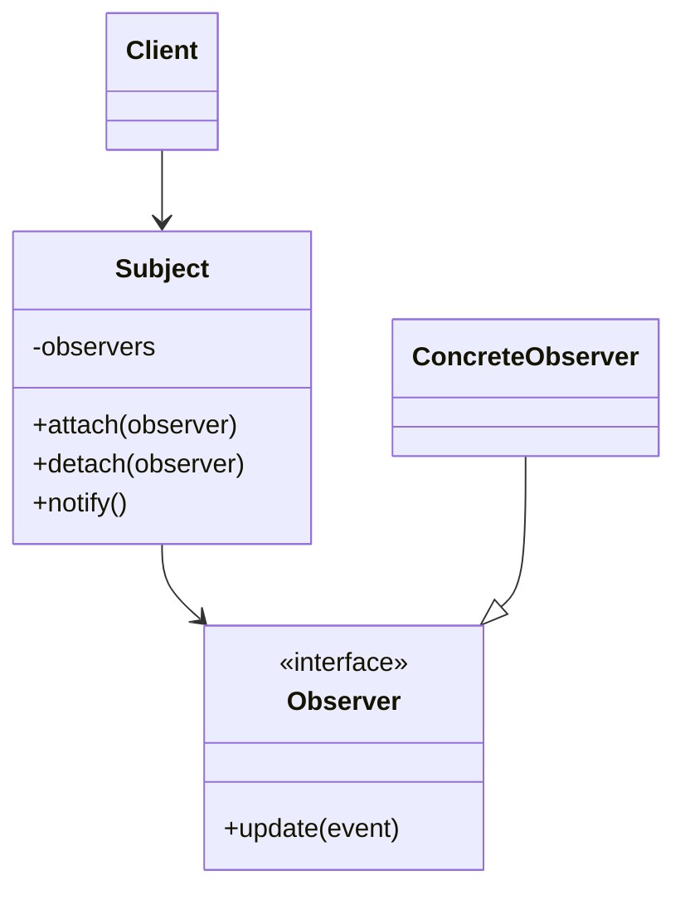

# Observer Pattern

## Target Pattern

**Pattern Name:** Observer

**Programming Language:** Python

**Learning Goal:** Hiểu mô hình đăng ký và nhận thông báo giữa object mà không coupling chặt.

---

## 1. Foundations

### 1.1 Problem Statement

Khi một object thay đổi trạng thái, nhiều object khác có thể cần biết để phản ứng. Nếu subject gọi trực tiếp từng object cụ thể, subject bị coupling với toàn bộ subscriber.

Pain point:

- Object nguồn phải biết quá nhiều object phụ thuộc.
- Thêm listener mới phải sửa subject.
- Flow thông báo rải rác và khó mở rộng.
- Các module bị phụ thuộc hai chiều.

### 1.2 Intent & Definition

Observer định nghĩa quan hệ one-to-many giữa object. Khi subject thay đổi, tất cả observer đã đăng ký sẽ được thông báo tự động.

Observer thuộc nhóm **Behavioral Pattern**.

### 1.3 UML Structure



---

## 2. Implementation Styles

### 2.1 Standard Implementation

```python
from abc import ABC, abstractmethod


class Observer(ABC):
    @abstractmethod
    def update(self, event: str, data: dict) -> None:
        pass


class Subject:
    def __init__(self) -> None:
        self._observers: list[Observer] = []

    def attach(self, observer: Observer) -> None:
        self._observers.append(observer)

    def detach(self, observer: Observer) -> None:
        self._observers.remove(observer)

    def notify(self, event: str, data: dict) -> None:
        for observer in self._observers:
            observer.update(event, data)


class EmailNotifier(Observer):
    def update(self, event: str, data: dict) -> None:
        print(f"Email notification for {event}: {data}")


class AuditLogger(Observer):
    def update(self, event: str, data: dict) -> None:
        print(f"Audit log for {event}: {data}")


order_events = Subject()
order_events.attach(EmailNotifier())
order_events.attach(AuditLogger())

order_events.notify("order_created", {"order_id": 123})
```

Pythonic variation với callback:

```python
from collections.abc import Callable


Callback = Callable[[str, dict], None]


class EventBus:
    def __init__(self) -> None:
        self._subscribers: list[Callback] = []

    def subscribe(self, callback: Callback) -> None:
        self._subscribers.append(callback)

    def publish(self, event: str, data: dict) -> None:
        for callback in self._subscribers:
            callback(event, data)
```

### 2.2 Common Variations

- Push model: subject gửi dữ liệu mới cho observer.
- Pull model: observer nhận thông báo rồi tự query subject.
- Event Bus/Pub-Sub: producer và subscriber không biết trực tiếp nhau.
- Async Observer: notify qua queue, task, message broker.

### 2.3 Key Mechanisms

- Loose coupling
- Subscription list
- Callback/interface
- Event propagation
- Inversion of control

---

## 3. Challenges & Pitfalls

### 3.1 Complexity Trade-offs

Observer làm flow chương trình bớt tuyến tính. Khi một event được phát ra, nhiều handler có thể chạy, khiến debugging khó hơn nếu không có logging tốt.

### 3.2 Common Mistakes

- Không unsubscribe observer không còn dùng, gây memory leak.
- Observer thực hiện tác vụ quá nặng trong luồng đồng bộ.
- Không xử lý lỗi của một observer, làm hỏng toàn bộ notify chain.
- Lạm dụng event khiến business flow bị ẩn.
- Event payload thiếu schema rõ ràng.

### 3.3 Constraints

- Thứ tự observer có thể quan trọng nhưng thường bị xem nhẹ.
- Race condition nếu notify trong môi trường concurrent.
- Dễ tạo dependency gián tiếp khó phát hiện.
- Khó trace khi có nhiều event nested.

---

## 4. Best Practices & Applications

### 4.1 Real-world Use Cases

- UI event listener: click, input, hover.
- Django signals.
- JavaScript event listeners.
- Domain events trong backend.
- Notification system.
- Cache invalidation khi dữ liệu thay đổi.

### 4.2 Comparison With Similar Patterns

| Pattern | Điểm giống | Điểm khác | Khi nào dùng |
|---|---|---|---|
| Observer | Gửi thông báo đến nhiều listener | Subject thường biết danh sách observer | Khi object thay đổi cần thông báo |
| Pub-Sub | Cũng dựa trên event | Producer/subscriber tách qua broker | Khi cần decoupling mạnh hơn |
| Mediator | Điều phối giao tiếp | Tập trung logic phối hợp trong mediator | Khi nhiều object giao tiếp phức tạp |
| Chain of Responsibility | Nhiều handler xử lý request | Handler chạy theo chuỗi và có thể dừng | Khi request cần đi qua pipeline |

### 4.3 When To Avoid

- Flow nghiệp vụ cần rõ ràng, tuần tự.
- Chỉ có một dependent object.
- Event làm logic khó trace hơn lợi ích.
- Cần đảm bảo transaction nghiêm ngặt nhưng event async chưa được thiết kế kỹ.

---

## 5. Interview & Deep Thinking

### 5.1 Interview Questions

- Observer khác Pub-Sub thế nào?
- Push model và pull model khác gì?
- Làm sao xử lý lỗi khi một observer fail?
- Observer có thể gây memory leak như thế nào?
- Khi nào nên dùng async event thay vì sync observer?

### 5.2 Design Discussion

Observer phù hợp khi nhiều module cần phản ứng với cùng một sự kiện mà subject không nên biết chi tiết. Nếu hệ thống lớn hơn, có thể tiến hóa sang Event Bus hoặc message broker. Điều quan trọng là event phải có tên, payload, và ownership rõ ràng.

---

## 6. Summary

### One-line Definition

Observer cho phép nhiều object đăng ký để nhận thông báo khi subject thay đổi.

### Mental Model

Một danh sách người theo dõi: khi có tin mới, tất cả người đăng ký được báo.

### Use When

- Một thay đổi cần kích hoạt nhiều phản ứng.
- Muốn giảm coupling giữa source và handlers.
- Cần mở rộng listener mà không sửa subject.

### Avoid When

- Flow cần cực kỳ rõ ràng và tuần tự.
- Event chỉ có một listener cố định.
- Không có chiến lược logging/error handling.

### Key Takeaway

Observer giúp mở rộng phản ứng theo event, nhưng phải quản lý traceability và lifecycle cẩn thận.
