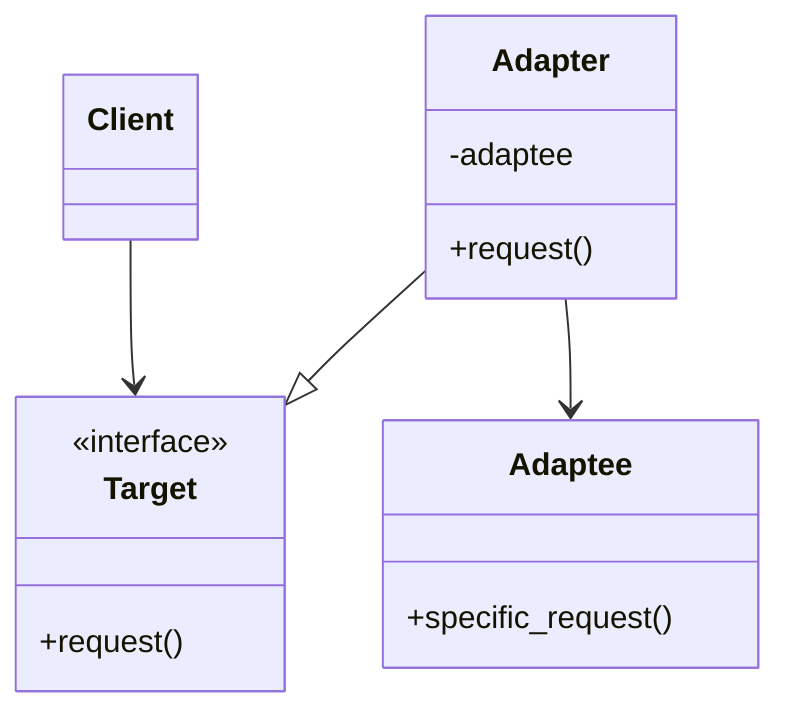

# Adapter Pattern

## Target Pattern

**Pattern Name:** Adapter

**Programming Language:** Python

**Learning Goal:** Hiểu cách kết nối các interface không tương thích mà không sửa code hiện có.

---

## 1. Foundations

### 1.1 Problem Statement

Trong thực tế, code mới thường phải làm việc với thư viện cũ, API bên thứ ba, hoặc class có interface khác với interface hệ thống đang kỳ vọng. Nếu sửa client hoặc sửa thư viện ngoài, code dễ vỡ và coupling tăng.

Pain point:

- Client kỳ vọng interface A nhưng object hiện có cung cấp interface B.
- Không thể hoặc không nên sửa code của class cũ/bên thứ ba.
- Logic chuyển đổi interface bị rải rác.
- Hệ thống phụ thuộc trực tiếp vào API ngoài.

### 1.2 Intent & Definition

Adapter chuyển đổi interface của một class thành interface khác mà client mong đợi, giúp các class không tương thích có thể làm việc cùng nhau.

Adapter thuộc nhóm **Structural Pattern**.

### 1.3 UML Structure



---

## 2. Implementation Styles

### 2.1 Standard Implementation

```python
from abc import ABC, abstractmethod


class PaymentGateway(ABC):
    @abstractmethod
    def pay(self, amount: float) -> None:
        pass


class StripeClient:
    def create_charge(self, cents: int, currency: str) -> None:
        print(f"Stripe charge: {cents} {currency}")


class StripeAdapter(PaymentGateway):
    def __init__(self, stripe_client: StripeClient) -> None:
        self.stripe_client = stripe_client

    def pay(self, amount: float) -> None:
        cents = int(amount * 100)
        self.stripe_client.create_charge(cents, "USD")


def checkout(payment_gateway: PaymentGateway) -> None:
    payment_gateway.pay(49.99)


stripe_gateway = StripeAdapter(StripeClient())
checkout(stripe_gateway)
```

Điểm quan trọng:

- `PaymentGateway` là interface hệ thống mong muốn.
- `StripeClient` là class có interface không tương thích.
- `StripeAdapter` dịch `pay(amount)` thành `create_charge(cents, currency)`.

### 2.2 Common Variations

- Object Adapter: adapter chứa adaptee bằng composition.
- Class Adapter: adapter kế thừa adaptee, ít phổ biến trong Python khi cần rõ dependency.
- Two-way Adapter: chuyển đổi hai chiều giữa hai interface.
- Anti-corruption Layer: adapter ở cấp kiến trúc để bảo vệ domain khỏi API ngoài.

### 2.3 Key Mechanisms

- Composition
- Interface translation
- Delegation
- Dependency inversion
- Boundary isolation

---

## 3. Challenges & Pitfalls

### 3.1 Complexity Trade-offs

Adapter thêm một lớp trung gian. Nếu interface khác nhau rất ít, adapter có thể hơi thừa. Nhưng khi API ngoài phức tạp, adapter giúp cô lập sự phức tạp đó.

### 3.2 Common Mistakes

- Để client biết cả adapter lẫn adaptee.
- Nhét quá nhiều business logic vào adapter.
- Không chuẩn hóa error từ API ngoài.
- Adapter bị rò rỉ kiểu dữ liệu hoặc exception của bên thứ ba.
- Tạo adapter cho interface chưa ổn định.

### 3.3 Constraints

- Adapter không tự giải quyết sự khác biệt semantic sâu giữa hai API.
- Mapping dữ liệu có thể tốn chi phí.
- Nếu API ngoài thay đổi nhiều, adapter cần được bảo trì thường xuyên.

---

## 4. Best Practices & Applications

### 4.1 Real-world Use Cases

- Tích hợp payment provider: Stripe, PayPal, VNPay.
- Bọc API của service bên thứ ba.
- Chuyển đổi format dữ liệu legacy sang domain model.
- Làm cho thư viện cũ tương thích interface mới.
- Test adapter để mock service ngoài.

### 4.2 Comparison With Similar Patterns

| Pattern | Điểm giống | Điểm khác | Khi nào dùng |
|---|---|---|---|
| Adapter | Bọc object khác | Đổi interface để tương thích | Khi interface không khớp |
| Facade | Bọc subsystem | Đơn giản hóa interface phức tạp | Khi muốn API dễ dùng hơn |
| Decorator | Bọc object | Thêm hành vi, giữ cùng interface | Khi muốn mở rộng tính năng |
| Proxy | Bọc object | Kiểm soát truy cập/lazy/cache | Khi cần kiểm soát object thật |

### 4.3 When To Avoid

- Có thể sửa interface gốc một cách an toàn.
- Hai interface đã tương thích.
- Adapter chỉ đổi tên method mà không giảm coupling thật sự.
- Logic chuyển đổi quá phức tạp và cần design lại boundary.

---

## 5. Interview & Deep Thinking

### 5.1 Interview Questions

- Adapter khác Facade thế nào?
- Object Adapter khác Class Adapter thế nào?
- Vì sao Adapter giúp giảm coupling với third-party API?
- Adapter có nên chứa business logic không?
- Anti-corruption Layer liên quan gì đến Adapter?

### 5.2 Design Discussion

Adapter là pattern rất thực tế trong integration. Khi đổi provider thanh toán, client chỉ nên phụ thuộc vào `PaymentGateway`, không phụ thuộc vào SDK cụ thể. Adapter tốt giữ cho domain code sạch và cô lập sự thay đổi từ bên ngoài.

---

## 6. Summary

### One-line Definition

Adapter chuyển đổi interface không tương thích thành interface mà client mong đợi.

### Mental Model

Một "đầu chuyển" giúp hai thiết bị khác chuẩn vẫn cắm được với nhau.

### Use When

- Cần dùng class/API có interface không khớp.
- Không thể sửa class gốc.
- Muốn cô lập dependency bên thứ ba.

### Avoid When

- Interface đã khớp.
- Có thể sửa thiết kế gốc.
- Adapter chỉ che giấu một boundary đang sai.

### Key Takeaway

Adapter không chỉ là đổi tên method; nó là cách bảo vệ client khỏi dependency không tương thích.
