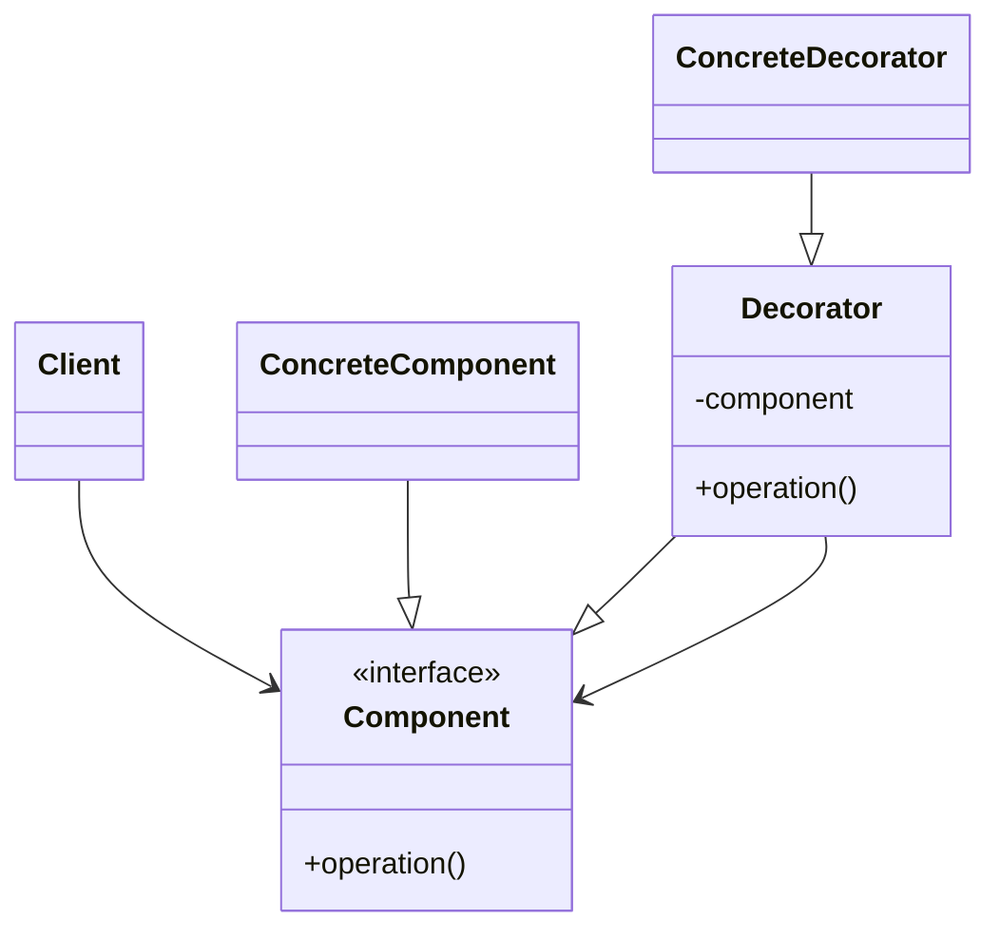

# Decorator Pattern

## Target Pattern

**Pattern Name:** Decorator

**Programming Language:** Python

**Learning Goal:** Hiểu cách mở rộng tính năng cho object bằng cách bao bọc thay vì sửa class gốc.

---

## 1. Foundations

### 1.1 Problem Statement

Khi cần thêm nhiều tính năng tùy chọn cho object, inheritance dễ tạo ra explosion of subclasses. Ví dụ: coffee có milk, sugar, caramel; stream có encryption, compression, buffering.

Pain point:

- Quá nhiều subclass cho từng tổ hợp tính năng.
- Sửa class gốc làm tăng rủi ro regression.
- Tính năng mở rộng cần kết hợp linh hoạt tại runtime.
- Inheritance cứng và khó thay đổi thứ tự hành vi.

### 1.2 Intent & Definition

Decorator gắn thêm trách nhiệm mới cho object bằng cách wrap object đó trong một object khác có cùng interface.

Decorator thuộc nhóm **Structural Pattern**.

### 1.3 UML Structure



---

## 2. Implementation Styles

### 2.1 Standard Implementation

```python
from abc import ABC, abstractmethod


class Coffee(ABC):
    @abstractmethod
    def cost(self) -> float:
        pass

    @abstractmethod
    def description(self) -> str:
        pass


class SimpleCoffee(Coffee):
    def cost(self) -> float:
        return 2.0

    def description(self) -> str:
        return "Simple coffee"


class CoffeeDecorator(Coffee):
    def __init__(self, coffee: Coffee) -> None:
        self.coffee = coffee


class MilkDecorator(CoffeeDecorator):
    def cost(self) -> float:
        return self.coffee.cost() + 0.5

    def description(self) -> str:
        return f"{self.coffee.description()}, milk"


class CaramelDecorator(CoffeeDecorator):
    def cost(self) -> float:
        return self.coffee.cost() + 0.8

    def description(self) -> str:
        return f"{self.coffee.description()}, caramel"


coffee = SimpleCoffee()
coffee = MilkDecorator(coffee)
coffee = CaramelDecorator(coffee)

print(coffee.description())  # Simple coffee, milk, caramel
print(coffee.cost())         # 3.3
```

Lưu ý: Python cũng có decorator function với `@decorator`, nhưng đó là một cơ chế ngôn ngữ. Nó có tinh thần tương tự: wrap function/class để thêm hành vi.

### 2.2 Common Variations

- Object Decorator: wrap object runtime.
- Function Decorator: wrap function bằng `@decorator`.
- Multiple Decorators: xếp chồng nhiều wrapper.
- Transparent Decorator: giữ interface giống component.

### 2.3 Key Mechanisms

- Composition over inheritance
- Same interface wrapping
- Delegation
- Runtime composition
- Open/Closed Principle

---

## 3. Challenges & Pitfalls

### 3.1 Complexity Trade-offs

Decorator tạo nhiều lớp nhỏ và nhiều tầng wrap. Debug stack có thể dài, và thứ tự decorator có thể ảnh hưởng kết quả.

### 3.2 Common Mistakes

- Decorator không giữ cùng interface với component.
- Thứ tự decorator không được kiểm soát.
- Dùng decorator cho logic nên nằm trong component gốc.
- Tạo quá nhiều wrapper nhỏ khó đọc.
- Nhầm Decorator với Adapter hoặc Proxy.

### 3.3 Constraints

- Object identity có thể khó hiểu vì object bị wrap nhiều lần.
- Nếu interface component lớn, decorator phải forward nhiều method.
- Debugging khó hơn khi có nhiều lớp lồng nhau.

---

## 4. Best Practices & Applications

### 4.1 Real-world Use Cases

- Python function decorators: logging, caching, authentication.
- Middleware trong web framework.
- Stream processing: buffering, compression, encryption.
- UI component thêm border, scroll, theme.
- Validation pipeline.

### 4.2 Comparison With Similar Patterns

| Pattern | Điểm giống | Điểm khác | Khi nào dùng |
|---|---|---|---|
| Decorator | Bọc object | Thêm hành vi, giữ interface | Khi muốn mở rộng tính năng runtime |
| Adapter | Bọc object | Đổi interface | Khi interface không tương thích |
| Proxy | Bọc object | Kiểm soát truy cập | Khi cần lazy, cache, permission |
| Composite | Cùng interface | Tổ chức cây object | Khi cần part-whole hierarchy |

### 4.3 When To Avoid

- Tính năng mở rộng cố định và đơn giản.
- Interface quá lớn khiến wrapper nặng nề.
- Thứ tự hành vi quá khó kiểm soát.
- Inheritance hoặc composition đơn giản đã đủ rõ.

---

## 5. Interview & Deep Thinking

### 5.1 Interview Questions

- Decorator khác Adapter thế nào?
- Decorator khác Proxy thế nào?
- Vì sao Decorator giúp tránh subclass explosion?
- Thứ tự decorator có quan trọng không?
- Python `@decorator` liên quan gì đến Decorator Pattern?

### 5.2 Design Discussion

Decorator hữu ích khi hành vi là các layer có thể bật/tắt và kết hợp. Nếu requirement thêm "logging", "retry", "cache", ta có thể wrap service thay vì sửa class gốc. Nhưng nếu quá nhiều decorator xuất hiện, cần cân nhắc pipeline hoặc middleware framework rõ ràng hơn.

---

## 6. Summary

### One-line Definition

Decorator mở rộng hành vi của object bằng cách wrap object đó trong object khác có cùng interface.

### Mental Model

Một lớp áo khoác thêm chức năng mà không thay đổi người mặc bên trong.

### Use When

- Cần kết hợp nhiều tính năng tùy chọn.
- Muốn mở rộng hành vi tại runtime.
- Muốn tránh subclass explosion.

### Avoid When

- Interface quá lớn.
- Chỉ cần một thay đổi đơn giản trong class gốc.
- Chuỗi wrapper làm flow khó hiểu.

### Key Takeaway

Decorator là composition linh hoạt để thêm hành vi mà không sửa object gốc.
