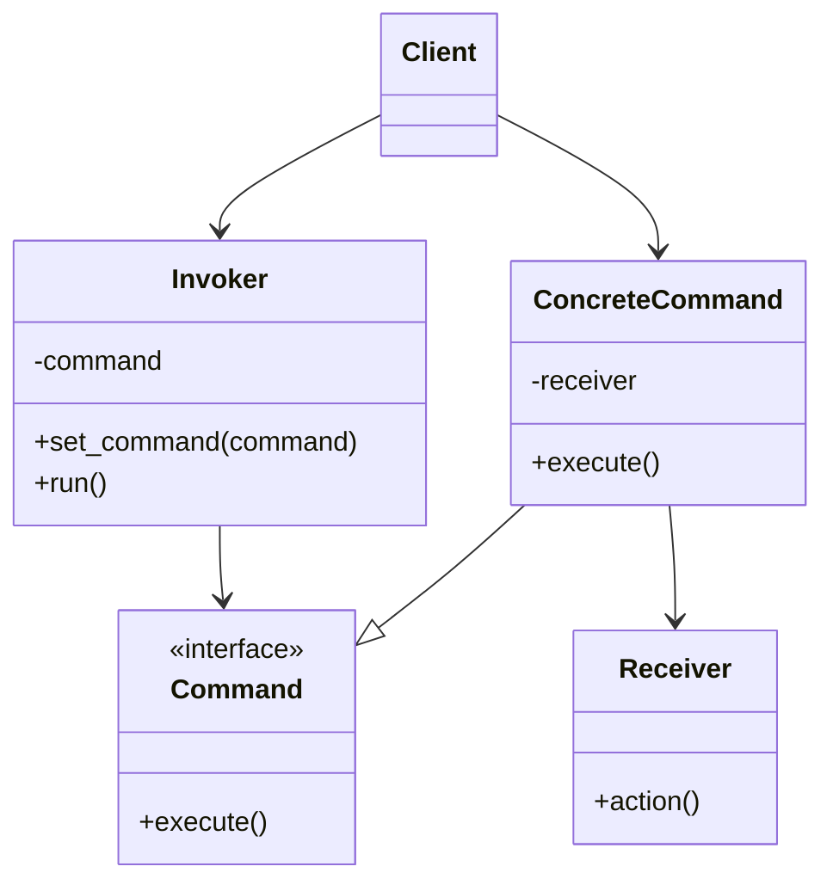

# Command Pattern

## Target Pattern

**Pattern Name:** Command

**Programming Language:** Python

**Learning Goal:** Hiểu cách đóng gói request thành object để có thể queue, log, retry, undo, hoặc truyền đi.

---

## 1. Foundations

### 1.1 Problem Statement

Nhiều hệ thống cần biểu diễn một hành động như dữ liệu: lưu lại để chạy sau, đưa vào queue, log lịch sử, undo/redo, hoặc truyền giữa layer. Nếu client gọi thẳng method trên receiver, request không thể dễ dàng được lưu, hoãn, hoặc tái thực thi.

Pain point:

- Invoker biết quá nhiều về receiver.
- Không thể queue hoặc retry hành động.
- Khó implement undo/redo.
- Logging/auditing request bị rải rác.

### 1.2 Intent & Definition

Command đóng gói một request thành object, tách object phát lệnh khỏi object thực thi lệnh.

Command thuộc nhóm **Behavioral Pattern**.

### 1.3 UML Structure



---

## 2. Implementation Styles

### 2.1 Standard Implementation

```python
from abc import ABC, abstractmethod


class Command(ABC):
    @abstractmethod
    def execute(self) -> None:
        pass

    def undo(self) -> None:
        raise NotImplementedError("Undo is not supported")


class Light:
    def turn_on(self) -> None:
        print("Light is on")

    def turn_off(self) -> None:
        print("Light is off")


class TurnOnLightCommand(Command):
    def __init__(self, light: Light) -> None:
        self.light = light

    def execute(self) -> None:
        self.light.turn_on()

    def undo(self) -> None:
        self.light.turn_off()


class RemoteControl:
    def __init__(self) -> None:
        self.history: list[Command] = []

    def press(self, command: Command) -> None:
        command.execute()
        self.history.append(command)

    def undo_last(self) -> None:
        if not self.history:
            return
        command = self.history.pop()
        command.undo()


light = Light()
remote = RemoteControl()

remote.press(TurnOnLightCommand(light))
remote.undo_last()
```

Pythonic variation với callable:

```python
from collections.abc import Callable


class TaskQueue:
    def __init__(self) -> None:
        self._tasks: list[Callable[[], None]] = []

    def add(self, task: Callable[[], None]) -> None:
        self._tasks.append(task)

    def run_all(self) -> None:
        for task in self._tasks:
            task()


queue = TaskQueue()
queue.add(lambda: print("Send email"))
queue.add(lambda: print("Generate invoice"))
queue.run_all()
```

### 2.2 Common Variations

- Command with undo/redo.
- Macro Command: một command chứa nhiều command con.
- Queueable Command: command được serialize hoặc đưa vào job queue.
- Callable Command: dùng function/lambda trong Python.
- Command Handler: phổ biến trong CQRS hoặc application service layer.

### 2.3 Key Mechanisms

- Encapsulation of request
- Decoupling invoker and receiver
- Deferred execution
- History tracking
- Undo/redo support

---

## 3. Challenges & Pitfalls

### 3.1 Complexity Trade-offs

Command thêm class/object cho mỗi action. Nếu action đơn giản và không cần queue/undo/log/retry, pattern có thể làm code dài hơn.

### 3.2 Common Mistakes

- Dùng Command chỉ để gọi một method trực tiếp.
- Command chứa quá nhiều business logic thay vì điều phối receiver.
- Không định nghĩa rõ input/output của command.
- Undo không thật sự đảo ngược được side effect.
- Command phụ thuộc vào quá nhiều service.

### 3.3 Constraints

- Command có side effect khó rollback.
- Serialize command phức tạp nếu chứa object runtime.
- Retry command cần idempotency để tránh chạy trùng.
- Undo trong hệ thống thật thường cần event sourcing hoặc compensation logic.

---

## 4. Best Practices & Applications

### 4.1 Real-world Use Cases

- GUI button/menu action.
- Undo/redo trong editor.
- Job queue/background task.
- Transaction script trong application layer.
- CQRS command: `CreateOrderCommand`, `CancelOrderCommand`.
- CLI command dispatch.

### 4.2 Comparison With Similar Patterns

| Pattern | Điểm giống | Điểm khác | Khi nào dùng |
|---|---|---|---|
| Command | Đóng gói hành động | Biểu diễn request như object | Khi cần queue, log, undo, retry |
| Strategy | Đóng gói thuật toán | Tập trung vào cách làm | Khi cần đổi thuật toán |
| Observer | Kích hoạt hành động | Gửi thông báo đến nhiều listener | Khi event xảy ra cần nhiều phản ứng |
| Chain of Responsibility | Có nhiều handler | Request đi qua chuỗi handler | Khi nhiều handler có thể xử lý request |

### 4.3 When To Avoid

- Action quá đơn giản và gọi trực tiếp là rõ nhất.
- Không cần lưu, queue, retry, undo, hoặc audit.
- Command object không có lifecycle riêng.
- Pattern khiến application layer quá nhiều ceremony.

---

## 5. Interview & Deep Thinking

### 5.1 Interview Questions

- Command khác Strategy thế nào?
- Command giúp implement undo/redo như thế nào?
- Invoker và Receiver khác nhau ra sao?
- Khi nào command nên có return value?
- Làm sao retry command an toàn?

### 5.2 Design Discussion

Command mạnh khi request cần trở thành object có lifecycle riêng. Trong hệ thống backend, command thường đại diện cho ý định của user như `CreateOrder`. Trong UI, command đại diện cho action như copy, paste, undo. Nếu chỉ gọi method một lần và không cần metadata, command có thể là thừa.

---

## 6. Summary

### One-line Definition

Command đóng gói một request thành object để tách nơi phát lệnh khỏi nơi thực thi lệnh.

### Mental Model

Một "phiếu yêu cầu" có thể cất, xếp hàng, gửi đi, chạy lại, hoặc hoàn tác.

### Use When

- Cần queue hoặc deferred execution.
- Cần undo/redo.
- Cần log, audit, retry request.

### Avoid When

- Chỉ gọi method đơn giản.
- Không cần quản lý lifecycle của request.
- Undo/retry không khả thi hoặc không cần thiết.

### Key Takeaway

Command biến hành động thành dữ liệu, mở ra khả năng queue, history, undo, retry, và audit.
