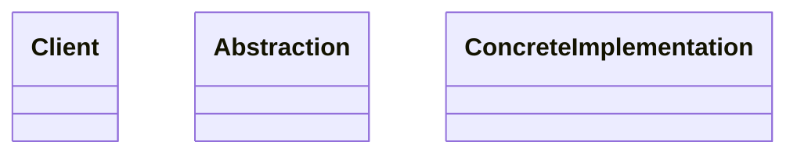

# Design Pattern Learning Template

Use this template to study any design pattern in a structured way.

## Target Pattern

**Pattern Name:** `[Design Pattern Name]`

**Programming Language:** `[Python / Java / C# / TypeScript / ...]`

**Learning Goal:** `[Interview / Project application / Architecture understanding / Pattern comparison]`

---

## 1. Foundations

### 1.1 Problem Statement

Explain the concrete software design problem this pattern solves.

Cover:

- The pain point before using this pattern
- Symptoms that suggest the code may need this pattern
- Why a direct or naive solution becomes hard to maintain

### 1.2 Intent & Definition

Explain:

- A short definition of the pattern
- Its core purpose
- The main idea behind the pattern
- Its GoF category: Creational, Structural, or Behavioral

### 1.3 UML Structure

Describe the UML structure of the pattern.

Cover:

- Main classes and interfaces
- Responsibility of each participant
- Relationships: inheritance, composition, aggregation, dependency
- How the client interacts with the pattern

Use Mermaid if possible:



---

## 2. Implementation Styles

### 2.1 Standard Implementation

Provide a standard implementation in **[Programming Language]**.

Requirements:

- Clear and readable code
- All required classes or interfaces
- Client usage example
- Explanation of the important parts

### 2.2 Common Variations

Analyze common variations of this pattern.

Examples:

- Lazy vs eager initialization
- Thread-safe vs non-thread-safe
- Interface-based vs inheritance-based
- Functional style vs OOP style
- Static configuration vs runtime configuration

### 2.3 Key Mechanisms

Explain the key programming techniques that make the pattern work.

Focus on:

- Encapsulation
- Polymorphism
- Composition
- Delegation
- Dependency inversion
- Runtime binding
- Object lifecycle, if relevant

---

## 3. Challenges & Pitfalls

### 3.1 Complexity Trade-offs

Explain how this pattern increases code complexity.

Cover:

- Additional classes or interfaces
- When abstraction becomes excessive
- Readability and maintainability cost
- Debugging impact

### 3.2 Common Mistakes

List common mistakes when applying this pattern.

Examples:

- Using the pattern for a problem that is too simple
- Confusing it with a similar pattern
- Overusing inheritance instead of composition
- Making the code harder to test
- Hiding business logic behind too many intermediate layers

### 3.3 Constraints

Analyze technical and architectural constraints.

Cover:

- Performance
- Unit testing
- Coupling and cohesion
- Possible SOLID violations when misused
- Scalability in larger systems
- Risks in concurrent or multithreaded environments, if relevant

---

## 4. Best Practices & Applications

### 4.1 Real-world Use Cases

Give real-world examples where this pattern appears in:

- Popular frameworks
- Well-known libraries
- Backend or frontend architecture
- Domains such as payment, notification, logging, UI, database, or caching

Explain why the pattern fits each case.

### 4.2 Comparison With Similar Patterns

Compare this pattern with similar or commonly confused patterns.

| Pattern | Similarity | Difference | When To Use |
|---|---|---|---|
| `[Pattern A]` | ... | ... | ... |
| `[Pattern B]` | ... | ... | ... |

### 4.3 When To Avoid

Explain when not to use this pattern.

Cover:

- The problem is too small
- The logic rarely changes
- The team does not need the additional abstraction
- The pattern makes the code harder to understand than necessary
- The language or framework already provides a simpler alternative

---

## 5. Interview & Deep Thinking

### 5.1 Interview Questions

Provide common interview questions about this pattern.

Include:

- Basic questions
- Advanced questions
- Trick questions
- Comparison questions with similar patterns

### 5.2 Design Discussion

Discuss practical design scenarios.

Cover:

- How this pattern helps when requirements change
- Whether this pattern still works when the system scales
- What would become worse if this pattern were removed
- Simpler alternatives, if any

---

## 6. Summary

### One-line Definition

`[Define the pattern in one sentence]`

### Mental Model

`[How should learners intuitively think about this pattern?]`

### Use When

- ...
- ...
- ...

### Avoid When

- ...
- ...
- ...

### Key Takeaway

`[The most important thing to remember about this pattern]`

---

## Reusable Prompt

```markdown
Analyze the design pattern: [Pattern Name]
Programming language: [Python / Java / C# / TypeScript / ...]
Learning goal: [Interview / Project application / Architecture understanding / Pattern comparison]

Please analyze it using this structure:

1. Foundations
- Problem Statement
- Intent & Definition
- UML Structure using Mermaid
- Main participants and their relationships

2. Implementation Styles
- Standard implementation with code
- Common variations
- Key mechanisms that make the pattern work

3. Challenges & Pitfalls
- Complexity trade-offs
- Common mistakes
- Constraints related to performance, testing, SOLID, and architecture

4. Best Practices & Applications
- Real-world use cases in frameworks or libraries
- Comparison with similar patterns
- When not to use this pattern

5. Interview & Deep Thinking
- Basic interview questions
- Advanced interview questions
- Trick questions
- Strong answer guidelines

6. Summary
- One-line definition
- Mental model
- Use when
- Avoid when
- Key takeaway

Requirements:
- Focus on architectural understanding, not only sample code.
- Code must be practical, readable, and include client usage.
- Explain the important implementation details.
```
